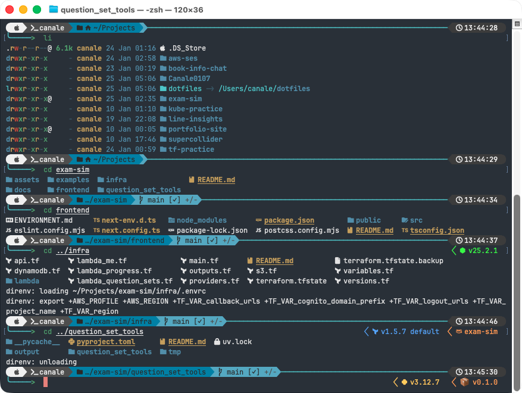

# Dotfiles

個人用の設定ファイルを管理するリポジトリです。

## ターミナルの外見



## 含まれる設定

- **zsh**: `.zshrc` 設定ファイル
- **git**: `.gitconfig` と `.gitignore_global` 設定ファイル
- **starship**: プロンプトカスタマイズ設定 (`starship.toml`)
- **nvim**: Neovim 設定 (`~/.config/nvim`)

## git のローカル分離（推奨）

このリポジトリの `git/.gitconfig` は `~/.gitconfig.local` を読み込むようになっています。
個人情報（`user.name` / `user.email`）やマシン固有設定は `~/.gitconfig.local` に置いてください。

例:

```bash
cp ./git/.gitconfig.local.example ~/.gitconfig.local
```

## 前提条件

以下のツールのインストールを推奨します（インストールスクリプトがチェックします）:

- **starship**: `curl -sS https://starship.rs/install.sh | sh`
- **fzf**: `brew install fzf`

## インストール方法

```bash
./install.sh
```

このスクリプトは、各設定ファイルをホームディレクトリにシンボリックリンクとして配置します。

## アンインストール方法

```bash
./uninstall.sh
```

シンボリックリンクを削除し、バックアップからの復元を選択できます。

## 構成

```
dotfiles/
├── git/
│   ├── .gitconfig
│   └── .gitignore_global
├── nvim/
│   ├── init.lua
│   └── lua/
│       └── core.lua
├── zsh/
│   └── .zshrc
├── starship/
│   └── starship.toml
├── install.sh
├── uninstall.sh
└── README.md
```

## 注意事項

- `install.sh` は既存のファイルを自動的にバックアップします（`~/.dotfiles_backup_YYYYMMDD_HHMMSS/` に保存されます）
- バックアップは **元のパス構造を保持**して保存され、復元用に `~/.dotfiles_backup_.../.manifest` が作成されます
- 既に正しいシンボリックリンクが設定されている場合は、スキップされます
- 既存のファイルや間違ったシンボリックリンクがある場合は、バックアップを取ってから新しいリンクを作成します
